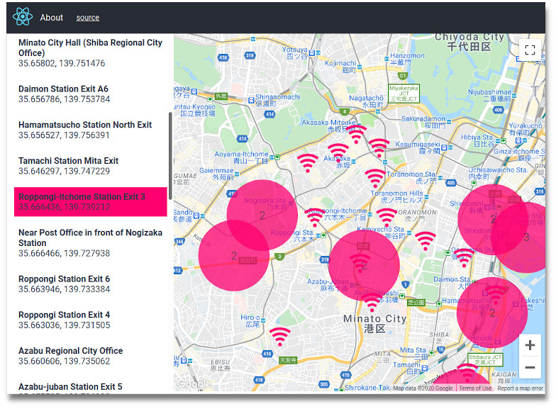

# map-supercluster-example

A sample React app to demonstrate plotting marker clusters on Google Maps.

[1. About](#about)  
[2. What I Did](#what)  
[3. Running + Building](#run-build)  
[4. LICENSE](#license)  

See [Demo](http://tokyo800.jp/mina/map-supercluster/)




<a id="about"></a>
## 1. About

A sample app plotting cluster markers on Google Maps.
Simply followed [Leigh Halliday's blog post](https://www.leighhalliday.com/google-maps-clustering).
`useSupercluster` hook is also developed by the same author.

These extra features may interest you:

- CRA
- CSS-in-JS  
Using [Emotion](https://github.com/emotion-js/emotion) + [TailwindCSS](https://github.com/tailwindlabs/tailwindcss).
It was hard once to integrate TailwindCSS with React,
but became incredibly easy with
[twin.macro](https://github.com/ben-rogerson/twin.macro).
- Redux state management with "Ducks"  
Clicking the menu list lets you navigate on the map area,
and it requires a clever structure for Redux state management.
So, I followed one of the "Ducks" proposals: [(Ducks: Redux Reducer Bundles)](https://github.com/erikras/ducks-modular-redux)
No. "Ducks" isn't obsolete. It is still powerful.


<a id="what"></a>
## 2. What I Did

### 2-1. CRA

```shell
yarn create react-app map-supercluster-example
```

### 2-2. Override CRA

This is to add `@emotion/babel-preset-css-prop`).

- `react-app-rewired`
- `customize-cra`

```shell
yarn add --dev react-app-rewired customize-cra
```

### 2-3. Redux with "Ducks"

- `redux`
- `react-redux`
- `redux-thunk`

```shell
yarn add redux react-redux redux-thunk
```

While there are many "Ducks" patterns, the idea is to manage Redux state per *feature*.  
For this app, I am follwing
[Ducks: Redux Reducer Bundles](https://github.com/erikras/ducks-modular-redux).

When it asynchronously fetches "Minato-city WiFi Spots" (which is a mock),
it stores the data to Redux state.  
As you can see in the tree bellow,
this `wifi_spot.js` contains *"reducers"*, *"selectors"*, and *"actions"* all in the same file.

```
src
└── ducks/
    ├── modules/
    │   ├── data/
    │   │   └── minato_city.js
    │   │       Minato-city WiFi Spots (mock)
    │   ├── index.js
    │   │   Exports "rootReducer"
    │   └── wifi_spot.js
    │       Reducers, Selectors, Actions, etc...
    └── index.js
        Exports "createStore"
```


### 2-4. Routing

#### (a) Installation

- `react-router-dom`

```shell
yarn add react-router-dom
```

#### (b) Subdirectory

I want to serve the app at `/mina/map-supercluster`.  
So, the URL becomes:  
http://tokyo800.jp/mina/map-supercluster/

CRA lets you do this very easily.  
You simply set the path to `"homepage"` in your `package.json`,
and it becomes available as: `process.env.PUBLIC_URL`

`package.json`
```json
"homepage": "/mina/map-supercluster",
```

and, you tell the React router about the path:

`src/index.jsx`
```jsx
ReactDOM.render(
  <Provider store={store}>
    <Router basename={process.env.PUBLIC_URL}>
      <App />
    </Router>
  </Provider>,
  document.getElementById('root')
);
```


### 2-5. Google API Key

I have `.env` which is not tracked in the Git repository.  
In it, I have:

```
REACT_APP_GOOGLE_API_KEY={My Google API Key}
```

Now, it becomes available from anywhere as:
```
process.env.REACT_APP_GOOGLE_API_KEY
```


### 2-6. Emotion + TailwindCSS

In the past, it meant troubles, especially when integrating TailwindCSS with React apps.  
Now, it became extremely easy with [twin.macro](https://github.com/ben-rogerson/twin.macro).

**[Step 1] Install NPM packages**  

- `@emotion/core`
- `@emotion/styled` (this is optional)
- `@emotion/babel-preset-css-prop`
- `tailwindcss`
- `twin.macro`

```shell
yarn add --dev @emotion/core @emotion/styled @emotion/babel-preset-css-prop tailwindcss twin.macro
```

Although `babel-plugin-macros` was required in the past, CRA can now understand Babel macro syntax.  
However, you still need to install `@emotion/babel-preset-css-prop` for `css={...}` to work.
[more](https://github.com/emotion-js/emotion/issues/1237)


**[Step 2] Config files**  

`config-overrides.js`
```js
const { override, addBabelPresets } = require('customize-cra');

module.exports = override(
  addBabelPresets(
    '@emotion/babel-preset-css-prop'
  )
)
```

`babel-plugin-macros.config.js`
```js
module.exports = {
  twin: {
    preset: 'emotion',
    config: './src/tailwind.config.js',
  },
}
```

`src/tailwind.config.js`
```js
module.exports = {
  theme: {},
  variants: {},
  plugins: [],
}
```

**[Step 3] Use them!!**  

```js
import css from '@emotion/css/macro'
import tw from 'twin.macro';

const homeStyle = tw`flex flex-row pt-4 bg-gray-100 text-gray-800`;

export const Home => () => ({
  <div css={homeStyle}>
    <h1>Home</h1>
  </div>
})
```


### 2-7. Google Maps + Cluster Markers

- `google-map-react`
- `supercluster`
- `use-supercluster`

```shell
yarn add google-map-react supercluster use-supercluster
```

Followed [Leigh Halliday's blog post](https://www.leighhalliday.com/google-maps-clustering).


<a id="run-build"></a>
## 3. Running + Building

**## dev**

```shell
yarn start
```

**## prod**

```shell
yarn build
```


<a id="license"></a>
## 4. License

Dual-licensed under either of the followings.  
Choose at your option.

- The UNLICENSE ([LICENSE.UNLICENSE](LICENSE.UNLICENSE))
- MIT license ([LICENSE.MIT](LICENSE.MIT))

For codes utilizing `useSupercluster` is credited to [Leigh Halliday](https://www.leighhalliday.com/google-maps-clustering).

Minato-city WiFi Spot Data  
CC BY 4.0  
Provided by Minato-city, Tokyo.  
https://catalog.data.metro.tokyo.lg.jp/dataset/t131032d0000000022

WiFi Icon made by [Freepik](https://www.flaticon.com/authors/freepik) from [www.flaticon.com](https://www.flaticon.com/).
